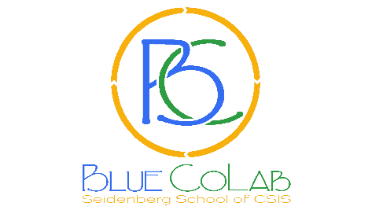
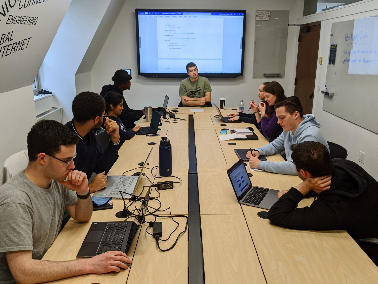
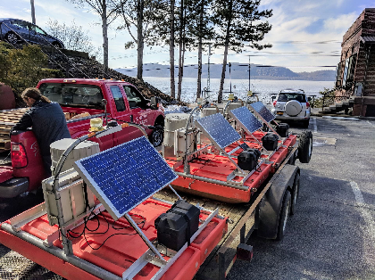

<h1> Blue CoLab Student Handbook </h1>

<b>Pace University · Seidenberg School of CSIS</b>

<i>Silas Gonzalez, Martin Kapiti, Lizi Imedashvili, Mikhaila Gordon, Victor Lima, Leanne Keeley, Kenji Okura</i>

---

## Table of Contents

- [Table of Contents](#table-of-contents)
- [Introduction to Blue CoLab](#introduction-to-blue-colab)
  - [Mission](#mission)
  - [What We Do](#what-we-do)
  - [Teams](#teams)
  - [Machines](#machines)
    - [Alan and Ada — Choate Pond Deep Water Monitoring Stations](#alan-and-ada--choate-pond-deep-water-monitoring-stations)
    - [Odin — Weather Station](#odin--weather-station)
    - [Skadi and Njord — Purple Air Monitoring Stations](#skadi-and-njord--purple-air-monitoring-stations)
    - [Servers — Cron Jobs and Data Transfer](#servers--cron-jobs-and-data-transfer)
    - [Gale Epstein Center Kiosk](#gale-epstein-center-kiosk)
  - [Pace Environmental Observatory](#pace-environmental-observatory)
- [Code of Conduct](#code-of-conduct)
  - [Our Pledge](#our-pledge)
  - [Where This Code Applies](#where-this-code-applies)
  - [Our Standards](#our-standards)
  - [Intolerable Behavior](#intolerable-behavior)
  - [Station, Field, and Lab Etiquette](#station-field-and-lab-etiquette)
  - [Reporting a Violation](#reporting-a-violation)
  - [Leadership's Responsibilities](#leaderships-responsibilities)
  - [On Academic Integrity](#on-academic-integrity)
- [Terminology](#terminology)
  - [Science Terminology](#science-terminology)
  - [GitHub Terminology](#github-terminology)
- [Projects](#projects)
  - [Application Programming Interface (API)](#application-programming-interface-api)
  - [Water Report](#water-report)
  - [Purple Air](#purple-air)
  - [Sonification](#sonification)
  - [Communication, UI/UX, and Frontend Development](#communication-uiux-and-frontend-development)
- [Data Access and Resources](#data-access-and-resources)
- [Locations and Communications](#locations-and-communications)
  - [Data Lab](#data-lab)
  - [Technology Lab](#technology-lab)
  - [Water Monitor Stations](#water-monitor-stations)
  - [Contacts](#contacts)
  - [Online Resources](#online-resources)

---

## Introduction to Blue CoLab

### Mission

Blue CoLab is a program of training, innovation, and research in real-time water monitoring technologies, committed to the principle that the human right to clean water requires the right-to-know water is clean. Blue CoLab is dedicated to the proposition that you have the right-to-know the quality of your water before you drink it, swim in it, fish it, or even swamp your canoe.

### What We Do

In the course, students are put into different teams (see [Teams](#teams)) with specific designated goals that intertwine with each other. Whether you have a background in computer science, policy, or humanitarian fields, this is the place to put your work into real practice.

In Blue CoLab, students have the option to pick 1–3 credit classes.

### Teams

Every semester, students join one (or more) of the following teams. Each team's day-to-day workflow is described in detail in the [Projects](#projects) section further down this handbook.

| Team | Focus |
| :--- | :--- |
| **Application Programming Interface (API)** | Builds and maintains the API that serves station data |
| **Water Report** | Converts Pace's yearly drinking water quality PDF reports into structured, database-ready data |
| **Purple Air** | Maintains and monitors the campus air quality stations |
| **Sonification** | Turns Choate Pond water quality data into sound |
| **Communication, UI/UX, & Frontend Development** | Presents Blue CoLab's data through the kiosk, dashboard, and mobile app |

> Keep in mind that projects stop, new projects are created, and some projects might not be active every semester.

### Machines

#### Alan and Ada — Choate Pond Deep Water Monitoring Stations

"Ada" and "Alan" are our team's first deployments of real-time water monitoring stations that will compose the Choate Smart Pond Network on the Pace University campus in Pleasantville, NY. Every fifteen minutes, they collect water quality measurements from the pond and send that data to the Blue CoLab server, where a Blue CoLab program automatically calculates a Water Quality Index. We use that data to evaluate the pond, and to create apps, products, and presentations that deepen public understanding of water.

#### Odin — Weather Station

A self-contained weather station from Campbell Scientific. It monitors aspects of weather such as lightning strikes, vapor pressure, humidity, and more — totaling 15 weather parameters.

#### Skadi and Njord — Purple Air Monitoring Stations

"Skadi" and "Njord" are our real-time air quality monitoring stations. Every fifteen minutes they collect information about the quality of the air we breathe. They are connected to Pace's Wi-Fi and, from there, to PurpleAir's public sensor network so anyone can see the data collected from our campus. We also collect historic data directly from the stations and store it in our databases. The public can access this data using our API, or see visualizations of it in the mobile app, the website, the kiosk, or several other places.

#### Servers — Cron Jobs and Data Transfer

We are responsible for two servers. One fetches data from Ada, Alan, Odin, and our Purple Air deployments and transfers it into our database — a cron job (a scheduled task) runs every 15 minutes to query data and save it. The other server is a sandbox for experiments. We use both servers as important testbeds before we send the code over to Pace University to deploy.

#### Gale Epstein Center Kiosk

The kiosk is an interactive touchscreen on the 3rd floor of Seidenberg. Its purpose is to teach curious minds about water and their right to know its quality, introduce new students to the Blue CoLab program, and bring together the projects built by the teams who came before us. The goal of the kiosk is to educate the Pace population on the Gale Epstein Center and Blue CoLab.

On it, you can:

- Learn more about the Blue CoLab program
- Meet the previous Millennium Fellowship teams
- Explore student-built dashboards tracking the water quality of Choate Pond, air quality, and the Hudson River
- Find historical water reports tied to Pace University
- Get introduced to our app
- Play games, watch videos, browse photos, and follow Blue CoLab news

### Pace Environmental Observatory

The goal of the app is to inform the Pace population about the environmental conditions on their campus, and to inspire others to do the same.

It covers four core sections:

- **Water** — Water quality measured every fifteen minutes by solar-powered underwater sensors deployed by Blue CoLab.
- **Weather** — More than 20 climate conditions measured every five minutes by the sensor-based weather station Blue CoLab built near Miller Hall.
- **Air** — Our local Air Quality Index, part of the federal AirNow program, which also issues alerts when air quality threatens human health, as part of Purple Air deployments across the campus.
- **Drinking Water** — Yearly reports on Pleasantville campus water quality, published by the university in compliance with state and federal law.

**Download:**

- **iOS:** <https://apps.apple.com/us/app/aquawatch-mobile/id6754177174>
- **Android:** <https://github.com/bluecolab/pace-observatory-app/releases>
- **PWA:** <https://pace-environmental-observatory.expo.app/>

---

## Code of Conduct

### Our Pledge

Blue CoLab trains students in real-time water monitoring technology, built on the idea that people have a right to know the quality of their water. That mission only works if the people building it — whether they come from computer science, policy, science, or humanitarian backgrounds — feel safe, respected, and able to do good work.

We're committed to making Blue CoLab a harassment-free space for everyone, regardless of background, experience level, or role on the team. If someone reports a problem, we treat their account with the same weight we'd want given to our own.

### Where This Code Applies

This Code of Conduct covers everywhere Blue CoLab work or community life happens, including:

- The Data Lab (Goldstein Academic Center, Floor 3, Rm 316) and the Technology Lab (47 Hudson Street, Ossining)
- Fieldwork at the Choate Pond stations (Ada and Alan) and any boat operations
- Our GitHub org, including issues, pull requests, code review, and discussions
- Our Discord communications
- Team meetings, scrums, and any Blue CoLab–sponsored events

It applies to everyone taking part in Blue CoLab: students on any team, project leads, faculty advisors, and anyone else contributing to the program's work.

### Our Standards

Building on the values already in the Blue CoLab handbook, we expect everyone to:

- Treat others how you want to be treated. This is the foundation everything else builds on.
- Hold each other accountable, respectfully and constructively.
- Assist others when possible. Teams depend on each other — the API team needs the Water Report team's data, and the Frontend team needs everyone's work to display anything at all. Helping each other is part of how Blue CoLab functions.
- Communicate honestly, including about mistakes, blockers, and disagreements.
- Give and receive feedback with respect, especially during pull request review and scrums.
- Handle equipment and data with care, and flag anything irregular instead of guessing at a fix.

### Intolerable Behavior

The following count as violations of this Code of Conduct:

- Harassment, intimidation, or discrimination of any kind, whether it happens in the lab, on the water, or online
- Personal attacks, insulting or derogatory comments, or repeatedly derailing discussions on GitHub, Discord, or in person
- Sharing someone else's private information without their permission
- Academic dishonesty as defined by Pace University's Academic Integrity policy, including cheating, fabrication, plagiarism, and misrepresenting your own work
- Unsafe behavior around equipment, stations, or during boat operations
- Throwing or trying to throw a person into the pond, or otherwise putting a teammate's physical safety at risk
- Retaliating against someone for reporting a Code of Conduct violation in good faith

### Station, Field, and Lab Etiquette

Because Blue CoLab work happens in physical spaces with sensitive equipment, the etiquette below is part of this Code of Conduct, not just a nice suggestion.

**Station Etiquette**

- Leave things as you found them. Return borrowed equipment and reset any settings you changed back to standard configuration.
- Handle sensors with care.
- Don't fix what you don't understand. Flag anything that looks off to a team lead or advisor instead.

**Boat Etiquette**

- Life jackets stay on the whole time — no exceptions.
- Keep your hands away from the motor. No reaching or leaning near it.
- Secure any loose gear before you head out.
- Clean up after yourself.

**General Safety**

- No throwing people in the pond, and try not to jump in yourself either.
- Stay 5 feet (1.5 meters) away from Phoenix Reginald Ellrodt for your own safety.

### Reporting a Violation

If you experience or witness something that violates this Code of Conduct, please report it. Reports are taken seriously and handled with discretion.

**To report a violation:**

- Email Prof. John Cronin at [jcronin@pace.edu](mailto:jcronin@pace.edu), or reach him on Discord (`croninonhudson`)
- Email Leanne Keeley at [lkeeley@pace.edu](mailto:lkeeley@pace.edu), or reach her on Discord (`sonetteira`)

When you report something, try to include:

- What happened and when
- Who was involved
- Any relevant context, like screenshots, GitHub links, or witnesses

You won't be asked to confront the person you're reporting. That's the job of whoever receives the report.

### Leadership's Responsibilities

Faculty advisors and student team leads are responsible for enforcing this Code of Conduct fairly and consistently, not just when it's convenient. That means:

- Taking every report seriously, no matter the role or seniority of the people involved
- Explaining decisions clearly, including when a report doesn't turn out to be a violation
- Protecting the safety and privacy of anyone who reports in good faith
- Revisiting and updating this Code of Conduct as the program and its teams change over time

### On Academic Integrity

Blue CoLab operates under Pace University's Academic Integrity policy. Violations such as cheating, fabrication, plagiarism, unauthorized collaboration, or misrepresenting your own work are handled under that university policy, in addition to anything covered here.

> This Code of Conduct draws on the [Contributor Covenant](https://www.contributor-covenant.org/) and GitHub's [Open Source Guide](https://opensource.guide/) on codes of conduct, adapted for Blue CoLab's mix of physical lab work, fieldwork, and open source software development.

---

## Terminology

### Science Terminology

**Buoy**
A floating object that can be anchored in position. Buoys are used to support our water-measuring hardware.

**Data Logger**
Also known as a Measurement and Control System, or Micrologger. Data loggers are the brain of a data acquisition system. They make measurements at a specified scan rate, process data, and initiate telecommunications. *(Campbell Scientific)*

**GPS (Global Positioning System)**
A satellite system used to determine geographic position and deviation. Campbell Scientific data loggers can interrogate some GPS receivers, then store the GPS position data. *(Campbell Scientific)*

**Incident**
An unexpected event affecting data integrity and/or a deployed platform for a given time period.

**Modem**
A device whose name combines the terms "modulate" and "demodulate," referring to its ability to transmit and receive data superimposed on a carrier frequency. In our usage, a modem also: (1) has the ability to raise the data logger's ring line, or be used with the SC32A to raise the ring line and put the data logger in the Telecommunications Command State, and (2) has an asynchronous serial communication port that can be configured to communicate with the data logger. *(Campbell Scientific)*

**Platform**
A buoy with additional hardware bolted onto it.

**Sensor**
A device that responds to a physical stimulus and transmits a signal, or changes an electrical property such as resistance. *(Campbell Scientific)*

**Sonde**
An instrument that obtains and transmits information about its surroundings from an inaccessible location, such as underground or underwater. *(Dictionary, n.d.)*

**Station**
A named data collection unit at a fixed location. Stations can be commissioned and decommissioned.

More terms related to the sensors can be found at:
- <https://bluecolab.pace.edu/ada-alan-2/>
- <https://bluecolab.pace.edu/water-quality-index-dashboard-2/>

### GitHub Terminology

**Scrum** — Consistent meetings in which a team or a person briefly shares the work they've achieved so far, what they're currently working on, and any obstacles in their way.

**Repository (repo)** — A project's folder, containing all its files, folders, and the complete history of changes made to them.

**Branch** — A separate version of the repository where you can make changes without affecting the main codebase. Think of it as a parallel workspace for testing ideas or building features.

**Commit** — A saved snapshot of changes, with a message describing what was done. Commits build up the project's history over time.

**Pull Request (PR)** — A request to merge changes from one branch into another. It's where teammates review code, leave comments, and discuss changes before they become part of the main project.

**Merge** — The act of combining changes from one branch into another, usually after a pull request is approved.

**Fork** — A personal copy of someone else's repository, letting you experiment freely without affecting the original project.

**Clone** — Downloading a full copy of a repository (including its history) to your own computer.

**Push** — Uploading your local commits to a remote repository (like GitHub) so others can see them.

**Pull** — Downloading the latest changes from a remote repository to your local copy.

**Issue** — A tracked item for bugs, tasks, or feature requests, used to discuss and organize work.

**README** — A file (usually `README.md`) that introduces a project's overview, how to install it, and how to use it.

**Main/Master branch** — The primary branch of a repository, typically considered the stable, production-ready version of the code.

---

## Projects

> Keep in mind that projects stop, new projects are created, and some projects might not be active every semester.

### Application Programming Interface (API)

Think of an API like a waiter at a restaurant. You (the client software) look at the menu and place your order (a request) with the waiter. The waiter takes your order to the kitchen (the database), and the kitchen prepares the food. Finally, the waiter brings the completed meal (the response) back to your table. On this team, you take care of the restaurant.

**Workflow Overview**

1. **Research** — Look into Application Programming Interface design.
2. **Coding** — Use Python to create data structures, object-oriented programs, and classes that request and display the latest data from our stations.
3. **GitHub Requesting** — Merge branches and request pulls into the main development branch to enhance its capabilities.
4. **Inter-communication** — Connect with Blue CoLab's other teams to get updates on the latest data.

### Water Report

Did you know Pace writes its own report detailing its water reserve each year? This team turns those water quality PDF reports into structured data and MariaDB-ready SQL scripts.

**Workflow Overview**

1. **Upload a PDF** — Use the upload panel to select a water quality report. The PDF preview renders in the side panel.
2. **Review contaminants** — Edit names, ranges, and metadata directly in the contaminant cards. Changes persist in the store.
3. **Generate SQL** — Extract data from documents into the water database.
4. **Writing** — Produce definitive reports to release at Pace University.
5. **Communication** — Spread the release of updated water reports and live data.

### Purple Air

We have two stations monitoring the air quality close to Pace University. This team manages these stations alongside the staff.

**Workflow Overview**

1. **Work on stations** — Maintain hardware connections.
2. **Deployment** — Ensure a steady release for stations Skadi and Njord.
3. **User Interface** — Build dashboards to better visualize gathered data.

### Sonification

This team aims to sonify (assign musical sounds to) the data produced by our Ada monitoring platform on Choate Pond, thus enabling the user to hear — and enjoy — the modulations of water quality.

**Workflow Overview**

1. **Experiment** — Extract, normalize, and analyze key data streams produced by our pond sensors.
2. **Brainstorm** — Work with your team to figure out how to best create a melody.

### Communication, UI/UX, and Frontend Development

Collecting data and having an API is useless unless we present the data in a user-friendly manner. This team displays the data we collect via a kiosk, dashboard, and an app — paired with messaging on why the data matters.

---

## Data Access and Resources

Getting started with Blue CoLab's data and codebase:

- **Intro GitHub Workshop:** <https://github.com/bluecolab/intro-git-workshop/tree/main>
- **Blue CoLab API:** <https://colabprod01.pace.edu/api/docs>

**Public Grafana Dashboards**

| Dashboard | Link |
| :--- | :--- |
| Weather | <https://colabprod01.pace.edu/grafana/public-dashboards/139d29dc18204fa28d1b39ef672c45f5> |
| Ada WQI | <https://colabprod01.pace.edu/grafana/public-dashboards/28b52eaadf8041d490b3bca36f16101c?orgId=1&refresh=15m> |
| Alan WQI | <https://colabprod01.pace.edu/grafana/public-dashboards/841327a5d5fa493b8f14d638ffe2041e?orgId=1&refresh=15m> |
| Water Monitor Ada | <https://colabprod01.pace.edu/grafana/public-dashboards/84619475e51f410ab57a389593c0593a> |
| Water Monitor Alan | <https://colabprod01.pace.edu/grafana/public-dashboards/35f205ad7f9d458e949406a5612d9f04> |

---

## Locations and Communications

### Data Lab

Pace University, Pleasantville
Goldstein Academic Center
Floor 3, Rm 316

### Technology Lab

47 Hudson Street
Ossining, NY 10562
United States

### Water Monitor Stations

- **Ada:** the south end of Choate Pond
- **Alan:** the north end of Choate Pond

### Contacts

**Prof. John Cronin**
[jcronin@pace.edu](mailto:jcronin@pace.edu) · Discord: `croninonhudson`

**Leanne Keeley**
[lkeeley@pace.edu](mailto:lkeeley@pace.edu) · Discord: `sonetteira`

### Online Resources

- **Blue CoLab Discord:** <https://discord.gg/Gguac3BPrF>
- **GitHub:** <https://github.com/bluecolab>
